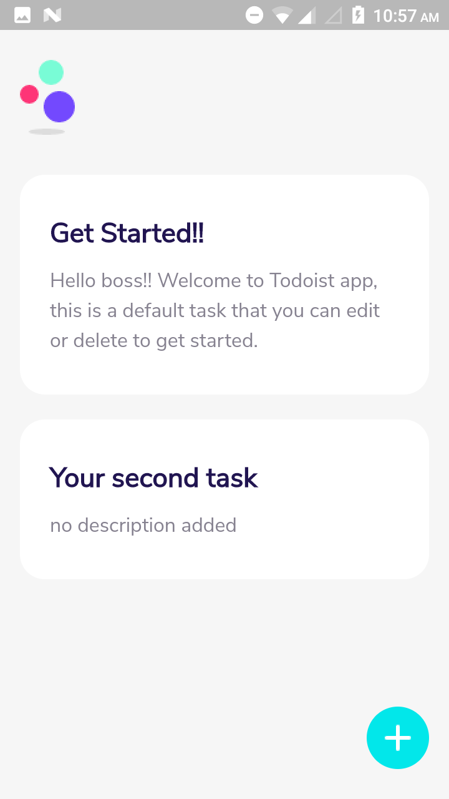
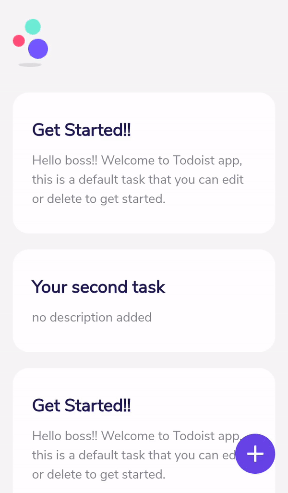

# todoist

A Todo application ...

#### Creating a project

- run the following command to create a new flutter project

```shell
$ flutter create <<todoist>>
cd todoist
```

- cleanup the boilerplate code and setup a dummy application
- add all the assets and link in the `pubspec.yaml` file
- add googlefonts and setup debug to false  
  `textTheme: GoogleFonts.nunitoSansTextTheme(Theme.of(context).textTheme)),` <br />
  `debugShowCheckedModeBanner: false,` in MaterialApp.

```dart
return MaterialApp(
  title: 'Flutter Demo',
  debugShowCheckedModeBanner: false,
  theme: ThemeData(
    primarySwatch: Colors.blue,
    visualDensity: VisualDensity.adaptivePlatformDensity,
    textTheme: GoogleFonts.nunitoSansTextTheme(Theme.of(context).textTheme)),
    home: MyHomePage(title: 'Todoist'),
);
```

- include the **assets/images** and use it in home

```dart
body: Center(
  child: Padding(
  padding: const EdgeInsets.fromLTRB(0, 15.0, 0, 0),
  child: Column(
    children: [
      Image(
        image: AssetImage('assets/images/logo.png'),
      ),
      Text('Todoist',
        style: TextStyle(fontSize: 32, fontWeight: FontWeight.bold)),
      ],
      ), //Column
    ), //Padding
  ); //Center
```

**Output**  


- add a **widgets** TaskCardWidget  
  with title and description of task to display in card like strucutre  
  refer to [this](./lib/widgets.dart) file.  
  now simply stack the floating button at the bottom of the screen.  
  **Output**
  

- Add a gesture detector in the floating button that navigate to task page on tap

```dart
GestureDetector(
  onTap: () {
    Navigator.push(
      context,
      MaterialPageRoute(
        builder: (context) => TaskPage()
      ),
    );
},
```

Now, on the **taskPage** add an arrow and TextField inside the container

```dart
child: Row(
  children: [
    InkWell(
      onTap: () {
        Navigator.pop(context);
      },
      child: Padding(
        padding: const EdgeInsets.all(24.0),
        child: Image(
          image: AssetImage('assets/images/back_arrow_icon.png')),
        ),
      ),
      Expanded(
        child: TextField(
        decoration: InputDecoration(
          hintText: 'Enter the task title',
          border: InputBorder.none),
          style: TextStyle(
            fontSize: 26.0,
            fontWeight: FontWeight.bold,
            color: Color(0xFF211551)),
        ),
      )
  ],
),
```
now start adding content to display the tasks
the taskPage file is linked [here](./lib/pages/taskPage.dart).
**Output**


---
Thank You
