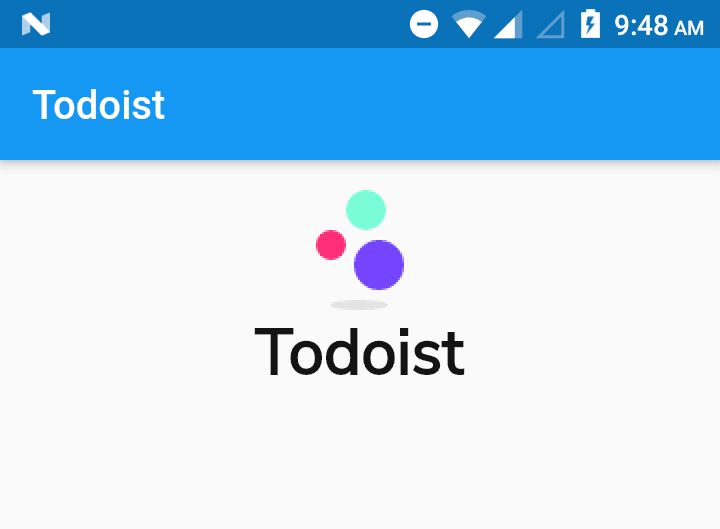

# todoist

A Todo application ...

#### Creating a project

- run the following command to create a new flutter project

```shell
$ flutter create <<todoist>>
cd todoist
```

- cleanup the boilerplate code and setup a dummy application
- add all the assets and link in the `pubspec.yaml` file
- add googlefonts and setup debug to false  
  `textTheme: GoogleFonts.nunitoSansTextTheme(Theme.of(context).textTheme)),` <br />
  `debugShowCheckedModeBanner: false,` in MaterialApp.

```dart
return MaterialApp(
  title: 'Flutter Demo',
  debugShowCheckedModeBanner: false,
  theme: ThemeData(
    primarySwatch: Colors.blue,
    visualDensity: VisualDensity.adaptivePlatformDensity,
    textTheme: GoogleFonts.nunitoSansTextTheme(Theme.of(context).textTheme)),
    home: MyHomePage(title: 'Todoist'),
);
```

- include the **assets/images** and use it in home

```dart
body: Center(
  child: Padding(
  padding: const EdgeInsets.fromLTRB(0, 15.0, 0, 0),
  child: Column(
    children: [
      Image(
        image: AssetImage('assets/images/logo.png'),
      ),
      Text('Todoist',
        style: TextStyle(fontSize: 32, fontWeight: FontWeight.bold)),
      ],
      ), //Column
    ), //Padding
  ); //Center
```
**Output**

